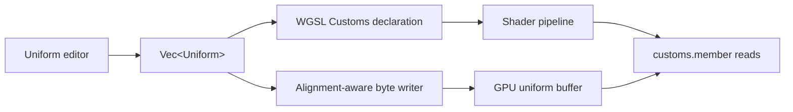

# Dynamic uniform-buffer layout

## Purpose

Bulin lets users add uniforms at runtime. The selected values are used to build
two representations of the same `Customs` structure:

1. a WGSL declaration compiled into the fragment shader; and
2. a byte buffer uploaded to the GPU.

Both representations must assign every member the same byte offset. Matching
the member types is not enough: WGSL also defines an alignment for each type and
rounds the final structure size up to the structure's alignment.



The implementation is split between [`Type`](../../src/uniforms_editor/uniform.rs),
which knows how an individual value is represented, and the
[canvas-scene serializer](../../src/viewer/canvasscene/mod.rs), which lays out the
complete runtime-defined structure.

## WGSL layout rules used by Bulin

All current uniform values are made from 32-bit scalar and vector types:

| Rust variants | WGSL type | Size | Alignment |
| --- | --- | ---: | ---: |
| `Int`, `Float` | `i32`, `f32` | 4 | 4 |
| `VecInt2`, `VecFloat2` | `vec2<i32>`, `vec2<f32>` | 8 | 8 |
| `VecInt3`, `VecFloat3`, `Col3` | `vec3<i32>`, `vec3<f32>` | 12 | 16 |
| `VecInt4`, `VecFloat4`, `Col4` | `vec4<i32>`, `vec4<f32>` | 16 | 16 |

For each structure member, its starting offset is rounded up to its alignment.
After the last member, the structure size is rounded up to the greatest member
alignment. Padding bytes are written as zero.

One important subtlety is that a `vec3` has size 12 but alignment 16. It does
not always consume 16 bytes: a following scalar may legally use bytes 12–15.

## Why the previous implementation failed

The previous serializer appended every payload directly after the preceding
payload. It accounted for value size but not member alignment or final structure
padding.

Consider this runtime definition:

```wgsl
struct Customs {
    intensity: f32,
    color: vec4<f32>,
}
```

The previous CPU buffer contained five tightly packed four-byte cells:

```text
Previous CPU buffer (20 bytes)

byte       0       4       8      12      16      20
           +-------+-------+-------+-------+-------+
contents   | inten |   R   |   G   |   B   |   A   |
           +-------+-------+-------+-------+-------+
```

WGSL requires `color` to begin at a multiple of 16, so the shader expects:

```text
WGSL structure layout (32 bytes)

byte       0       4       8      12      16      20      24      28      32
           +-------+-------+-------+-------+-------+-------+-------+-------+
contents   | inten |  pad  |  pad  |  pad  |   R   |   G   |   B   |   A   |
           +-------+-------+-------+-------+-------+-------+-------+-------+
```

The shader therefore looks for `color.r` at byte 16, where the old buffer placed
`color.a`, and the binding is 12 bytes smaller than the structure required by
the shader. Depending on validation and backend behavior, this causes pipeline
validation failure or incorrect uniform reads.

A single `Col3` exposed a related trailing-size problem:

```text
Previous buffer                         Required WGSL structure

0       4       8      12               0       4       8      12      16
+-------+-------+-------+                +-------+-------+-------+-------+
|   R   |   G   |   B   |                |   R   |   G   |   B   |  pad  |
+-------+-------+-------+                +-------+-------+-------+-------+
             12 bytes                                  16 bytes
```

Blindly padding every `vec3` to 16 bytes would also be wrong. This structure is
validly packed into 16 bytes because the scalar occupies the `vec3`'s remaining
four-byte slot:

```wgsl
struct Customs {
    color: vec3<f32>, // offset 0, size 12, alignment 16
    intensity: f32,   // offset 12
}
```

```text
0       4       8      12      16
+-------+-------+-------+-------+
|   R   |   G   |   B   | inten |
+-------+-------+-------+-------+
```

## Current serialization design

`Type` is the source of truth for an individual member:

- `wgsl_size()` returns its payload size;
- `wgsl_alignment()` returns its required starting alignment; and
- `write_payload()` writes only the selected variant's numeric values in
  little-endian order.

The enum's discriminant is never copied into the GPU buffer. `#[repr(C)]` is not
used because `Type` is a tagged runtime value, not the memory representation of
the generated WGSL structure.

The complete structure is serialized with this algorithm:

```text
bytes = empty
structure_alignment = 1

for each uniform in declaration order:
    structure_alignment = max(structure_alignment, uniform.alignment)
    pad bytes to align(current_length, uniform.alignment)
    append uniform payload

pad bytes to align(current_length, structure_alignment)
```

For the earlier scalar-plus-color example, the new writer produces the same
32-byte layout WGSL expects:

```text
New CPU buffer and WGSL layout

byte       0       4       8      12      16      20      24      28      32
           +-------+-------+-------+-------+-------+-------+-------+-------+
contents   | inten |  0x0  |  0x0  |  0x0  |   R   |   G   |   B   |   A   |
           +-------+-------+-------+-------+-------+-------+-------+-------+
```

This layout is recalculated whenever the runtime uniform list changes. Existing
pipeline logic compares the resulting buffer size and declaration text, then
recreates the buffer or shader pipeline when required.

## Invariants and verification

The serializer maintains these invariants:

- member order exactly matches the generated WGSL declaration order;
- every member begins at an offset divisible by its alignment;
- payload length equals the type's declared WGSL size;
- final buffer length is divisible by the structure alignment;
- padding is zero-filled; and
- an empty uniform list still produces no buffer or `Customs` declaration.

Unit tests cover standalone `Col3` and `Col4`, scalar/vector ordering, contextual
`vec3` packing, padding contents, final structure size, and metadata for every
currently supported `Type` variant. Any future variant must add matching shader
syntax, size, alignment, payload serialization, and layout tests.
